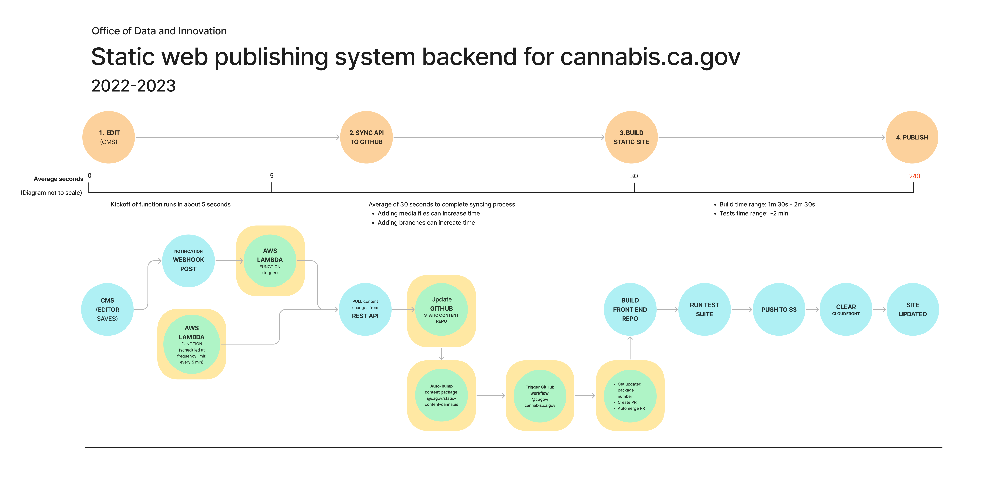

# Static content repo for cannabis.ca.gov

This is a content repository for https://headless.cannabis.ca.gov.

We load this content package as a bundle in our 11ty static site generator, located at @cagov/cannabis.ca.gov.

This separation allows us to keep our content separated from our 11ty renderer, without needing to write content directly into a multi-branched front-end development repo. 

## System diagram

## How it works
* Content is created and edited in WordPress at api.cannabis.ca.gov
* When posts, pages or media are added, updated or deleted a WordPress Notifications plugin will sent a webhook request to our AWS Lambda function.
* The function as a service (FaaS) AWS Lambda function is located at: https://github.com/cagov/cannabis-ca-gov-lambda-sync-github. 
  * This is an @architect arc.codes configuration. This is a framework for generating AWS CloudFormation configurations. 
  * This allows us to easily version our build settings. That code is manually updated by a developer with necessary access tokens.
* A POST request to the AWS Lambda endpoint will run the wordpress-to-github scripts. This codebase is currently using a local version of @cagov/wordpress-to-github while we perform some upgrades.
* This will run through a series of REST API endpoints and sync them to a target branch in github. * We are currently using these branches `main`, `staging` and `main-reduced-content` (debugging).
* Once content is written into the git repo, a series of GitHub workflow actions will run. Check @cagov/cannabis.ca.gov for more information.

## Publishing hints
### Preview link 
#### Published content
* A preview link from the WordPress editor to the headless.cannabis.ca.gov can be accessed in the top admin toolbar. "View Live Site" - this will jump you over to the static build. 
#### Pull request link
* When you submit a pull request to @cagov/cannabis.ca.gov, a preview link to your branch will be generated. Please note that this only updates the first time you submit the PR. If you need a fresh preview, close your pull request and open a new release.
#### Staged content
* [Not yet released]
#### Unpublished content
* Use the Enable Public Preview to generate a link that will expire in one week. This page will not be available on the production site.

### Time to update
* This whole process currently takes about 3 minutes. [Tests are currently disabled because we are revising our QA process.]

### Troubleshooting

To double check any issues in the pipeline: 
* Watch static-content-cannabis actions and make sure builds are running: https://github.com/cagov/static-content-cannabis/actions (Usually done in about 30-45 seconds. If there are many changes, it can get longer. If it gets stuck, manually/locally run the AWS Lambda service with `npm run start:debug`)
* Watch for updates on @cagov/cannabis.ca.gov: https://github.com/cagov/cannabis.ca.gov/actions
* The AWS Lambda configuration can be monitored by accessing AWS CloudFormation account, navigating to the deployment, then go to Resources and select the POST Lambda function. From there you will be able to go to the Monitoring tab.
* If there is an error, it will be reported to Slack channel #odi-bot-cannabis.

### Updating the editor
* The main plugin is local to the Pantheon repo (working on |check: `release/1.1.8-draft`|), but based on ca-gov-design-system-gutenberg-blocks. This plugin mirrors the CA Design System as Gutenberg Blocks. https://designsystem.webstandards.ca.gov.
* The editor is hosted on Pantheon, which let's us continuously upgrade the backend with security updates and evolving design system updates.
* Editor WordPress mirror: https://github.com/cagov/pantheon-mirror-cannabis-ca-gov (Currently not public because Divi is checked into the code base & is a paid WordPress plugin.)
* Check WordPress API endpoints for any rendering issues: https://api.cannabis.ca.gov/wp-json/
* Syncing configuration files live at: https://github.com/cagov/static-content-cannabis/blob/main/config/wordpress-to-github.config.json
* Automated site updates are managed at: https://github.com/cagov/cannabis-ca-gov-lambda-sync-github/blob/main/src/shared/config/endpoints.json (remember to `enableLocal: true` for any local debugging)
* All tokens for project developers can be accessed by contacting the Office of Data & Innovation engineering manager.

---

### Team maintenance notes
Project maintainer & lead: Chach Sikes (she/her) @chachasikes
Engineering manager: Zakiya Khabir @zakiyarules
Report an issue: https://github.com/cagov/cannabis.ca.gov
Slack channels: #odi-cannabis (ODI internal), #cagov-cannabis (Multi-partner channel)